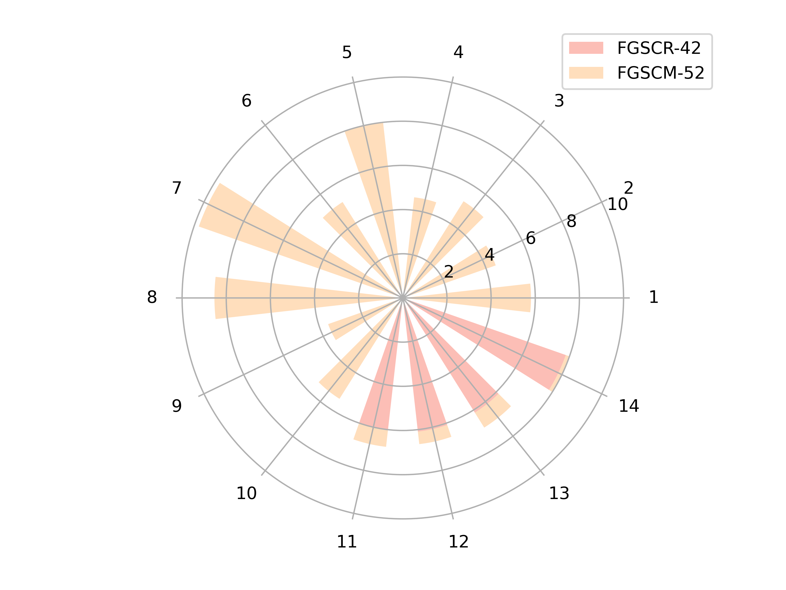
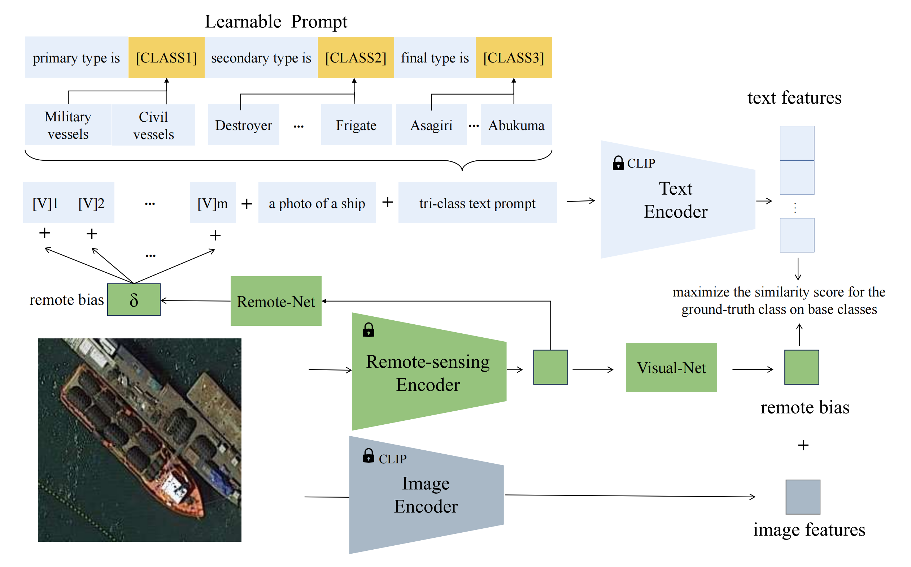

<p align="center">

  <h2 align="center"><strong>Efficient Prompt Tuning of Large Vision-Language Model for Fine-Grained Ship Classification</strong></h2>

  <p align="center">
      Long Lan<sup>1</sup>&nbsp;&nbsp;&nbsp;
   Fengxiang Wang <sup>1,‡</sup>&nbsp;&nbsp;
    Xiangtao Zheng<sup>2</sup>&nbsp
    Zengmao Wang<sup>3</sup> &nbsp;&nbsp;
    Xinwang Liu<sup>1</sup>&nbsp;&nbsp;&nbsp;
    </br></br>
  <sup>1</sup> National University of Defense Technology&nbsp;&nbsp;&nbsp;
  <sup>2</sup>Fuzhou University&nbsp;&nbsp;
  <sup>3</sup>Wuhan University&nbsp;&nbsp;</br>
  </p>

## 🔥 News
* **`2024.11.25`** 🌟 Paper is accepted by TGRS.
* **`2024.11.28`** 🌟 FGSCM-52 now has a [huggingface version]() and a [baidu version]().
* **`2024.11.29`** 🌟 Paper now has a new version [paper]().

## 👀 Intruduction
-  `FGSCM-52`: We contribute to the field by introducing a comprehensive dataset, FGSCM-52, significantly expanding existing datasets with more extensive data and detailed annotations for less common ship classes. </br>
- `Method`: We introduce a novel prompt tuning technique that employs a hierarchical, multi-granularity prompt design. Our approach integrates remote sensing ship priors through bias terms, learned from a small trainable network. This strategy enhances the model's generalization capabilities while improving its ability to discern intricate backgrounds and learn discriminative ship features. 


## To do List
- [x] Initial release of FGSCM-52. 🚀
- [ ] Codes and configs for method. 


## Outline

- [FGSCM-52](#FGSCM-52)
- [Installation](#gear-installation)
- [Training](#blue_car-Pretraining)
- [Citation](#citation)
- [License](#license)
- [Acknowledgements](#acknowledgements)


## FGSCM-52
FGSCM-52 has 52 categories, it includes an additional ten categories and increases the number of samples across existing categories, thereby making it serve as a better testbed for fine-grained ship classification. The dataset features image sizes ranging from 50*50 to 1,600*1,700 pixels. %This significant size variation of ship instances in RS-FGSC necessitates specialized handling. Furthermore, FGSCM-52 is equipped with well-defined hierarchical labels, which facilitate a more nuanced understanding of ship classifications. For a comprehensive overview of the FGSCM-52 dataset, please refer to Fig.

 

## Method
 

## Citation
If you find our work helpful for your research, please consider citing our work.   

```bibtex
@article{lan2024efficient,
  title={Efficient prompt tuning of large vision-language model for fine-grained ship classification},
  author={Lan, Long and Wang, Fengxiang and Li, Shuyan and Zheng, Xiangtao and Wang, Zengmao and Liu, Xinwang},
  journal={arXiv preprint arXiv:2403.08271},
  year={2024}
}
```

## License

This work is under the [Apache License Version 2.0](https://www.apache.org/licenses/LICENSE-2.0), while some specific operations in this codebase might be with other licenses. 

